# 👋 Olá, eu sou a Dhieimyla!

### 💻 Estudante de Ciência da Computação e desenvolvedora em formação 🇧🇷

 

- 🎓 Atualmente estudo **Ciência da Computação**
- 💻 Atualmente estou trabalhando em **projetos pessoais**
- 🌱 Atualmente estou aprendendo **JavaScript, desenvolvimento web e novas tecnologias**
- 🚀 Buscando transformar ideias em projetos reais
- 📚 Sempre aprendendo algo novo
- ☕ Café, código e muita curiosidade

 

<!-- 🐍 CONTRIBUIÇÕES -->

<picture>
  <source
    media="(prefers-color-scheme: dark)"
    srcset="https://raw.githubusercontent.com/dhieimyla/dhieimyla/output/github-contribution-grid-snake-dark.svg"
  />
  <source
    media="(prefers-color-scheme: light)"
    srcset="https://raw.githubusercontent.com/dhieimyla/dhieimyla/output/github-contribution-grid-snake.svg"
  />
  
</picture>

 

<h3>🔗 Conecte-se comigo:</h3>

<h3>🛠️ Linguagens e ferramentas:</h3>

 

<h3>📊 Minhas linguagens:</h3>

alt="Minhas linguagens mais usadas"
>

 

<h3>📈 Minhas estatísticas no GitHub:</h3>

alt="Minhas estatísticas no GitHub"
>

 

### 💙 Obrigada por visitar meu perfil!

⭐ Explore meus projetos e acompanhe minha evolução.

